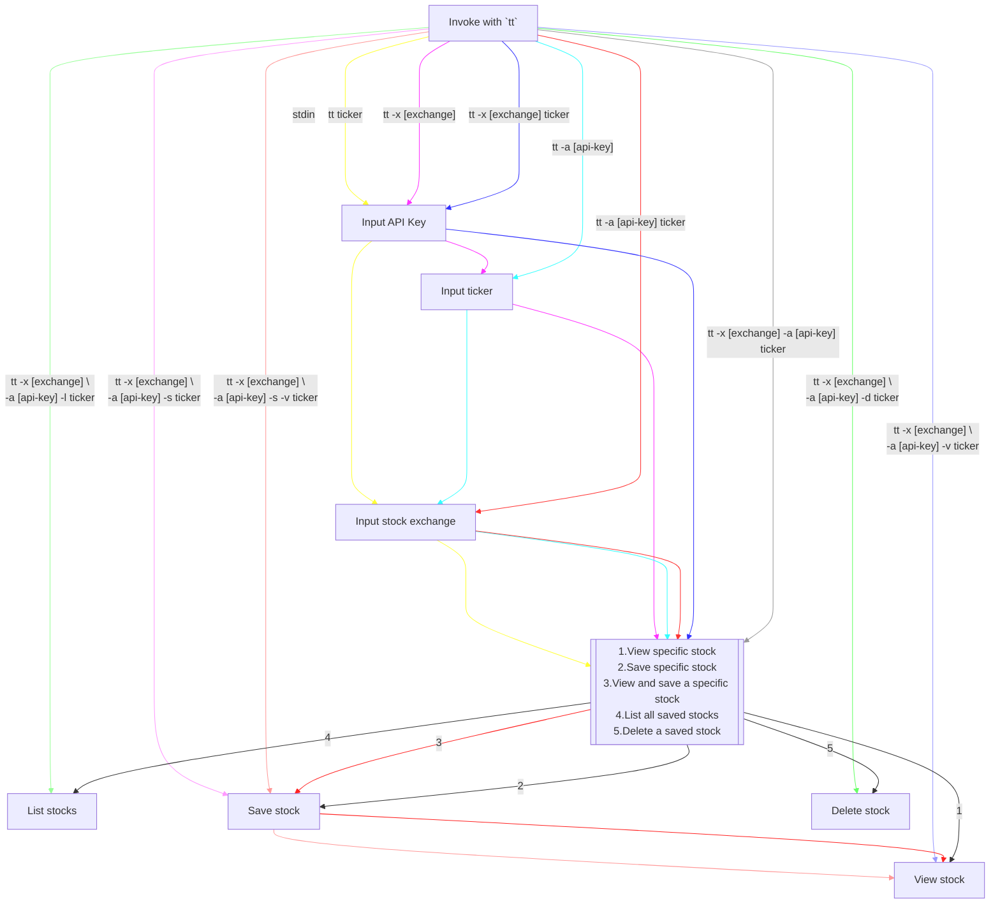

# Tilli Node.js Developer Challenge

Thank you for your interest in Tilli! The following coding challenge should take no longer than 2-3 hours. Please feel free to reach out for any clarification on the requirements presented below.

## Getting started

Fork this repository and use your fork to build the challenge. When you've finished and all of your work is pushed, let us know so that we can review (you can also submit a PR back to this repo to notify).

## Terminology

| Term               | Description               | AKA | Example(s) |
| :----------------- | :------------------------ | --- | ------- |
| Stock symbol       | A unique series of letters assigned to a stock for trading purposes (e.g. AAPL for Apple Inc.) | Stock ticker, Ticker symbol | AAPL (Apple Inc.) |
| Exchange           | A market where financial securities such as stocks, bonds, and commodities are traded. | Stock exchange | NASDAQ, NYSE, NSE |

## The challenge

Your task is to create an interactive Node.js CLI application that will show summary statistics for requested stock ticker symbols using the [Alpha Vantage](https://www.alphavantage.co/documentation/) API. The interactive CLI app will require managing and persisting state, processing input arguments, and showing interactive prompts and follow up prompts depending on the inputs. The application should be able to handle the below requirements for any amount of stock symbols on any exchange supported via the Alpha Vantage API.

### Features

The output below is a stubbed version of the helper text (`-h` or `--help` flag, though the actual output below is more representative of a `man` page) for the application. Flags in the `OPTIONS` section correspond with features. The interactive CLI app should be able to parse incoming arguments and generate interactive prompts to fill in missing information. Some sections are deliberately left incomplete (they will be marked via `[STUBBED]`); in your final submission should also include updated documentation.

Any implementation details that have not been included have been deliberately left out for you to create your own solution.

```bash
NAME
  tt - tilli ticker

SYNOPSIS
  tt [-x exchange] [-a api-key] [-c config-file] [exchange:]ticker

DESCRIPTION
  tt  a CLI app that allows you to continuously track stocks using the AlphaVantage API. An AlphaVantage API key is needed to use this utility.

OPTIONS
  -x exchange
      Specific stock exchange to use when doing the stock symbol lookup. This can be appended to the ticker argument directly by preceding the ticker argument with the exchange plus ":" (e.g. NASDAQ:AAPL) Throws if the exchange does not exist or if the stock symbol is not found on the exchange.

  -a api-key
      Use specified AlphaVantage API key. If no global config present or global config has no API key then interactive mode will launch to query the user for an API key.

  -v  View the stock's summary stats for the current day once found or chosen. Is inferred to be true if the -s flag is not present.

  -s  Save the stock symbol and its summary statistics.

  -l  View all saved stocks.

  -d  Delete a saved stock symbol.

FILES
  ~/.ttrc
    The global configuration file.

DIAGNOSTICS
  The following diagnostics may be issued on stderr:

  Rate limit exceeded.
    The API key used in the configuration has gone past the rate limit set by AlphaVantage's API. Please either wait for a new rate period or upgrade your API key.
  [STUBBED] - add additional potential diagnostics for errors here

AUTHOR
  [STUBBED] - make sure to sign your code!
```

### Interactive mode

The CLI app should launch interactive mode whenever additional input is needed from the user. Below is a diagram showing some of the code paths taken by interactive mode and how certain paths can be skipped via arguments being passed  in.



## Evaluation criteria

- UX of the interactive mode of the CLI
- Argument processing
- Caching strategies
- State management
- Error management
- Code hygiene
- Documentation
- Secrets management
- Clean git history

## Extra credit

> Doing any of the below will help your application (if *done well*) but your strength as a candidate is only measured using the tangibles above.

- use TypeScript
- add unit tests
- create a build process for distribution

## Some additional notes

Certain implementation details have been left out deliberately in order to gauge your ability to fill in the gaps. Don't be afraid to ask questions, but also don't be surprised if for certain questions the response is that it's up to you to determine that.

There are no reservations about libraries that you use, and it is definitely recommended that you use one (or multiple) of the many CLI tooling packages in the js ecosystem in order to focus on building the functionality rather than the barebones CLI portion of this application.

Make sure to review all of the evaluation criteria! These are the exact points you will be judged on.