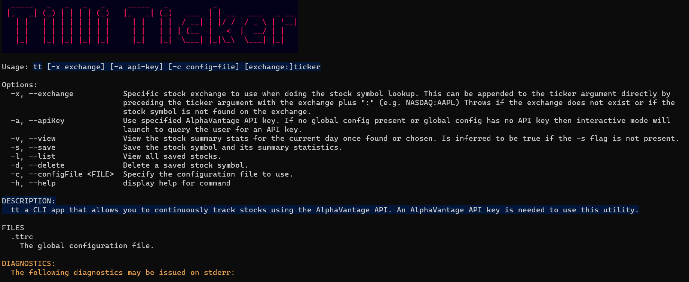
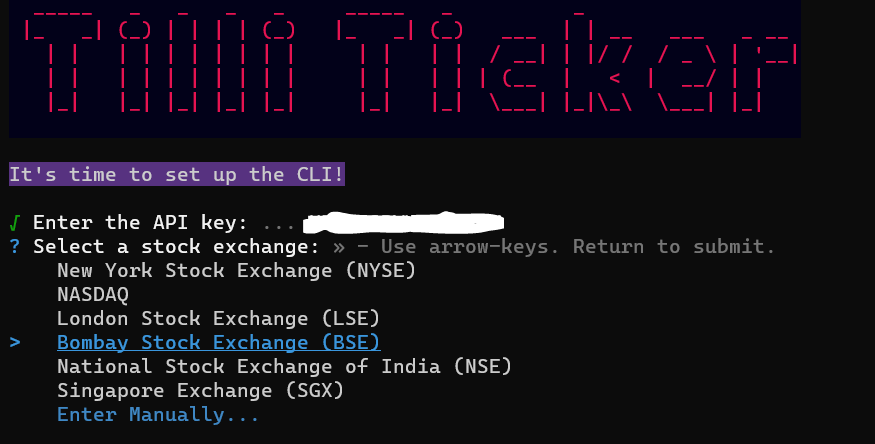
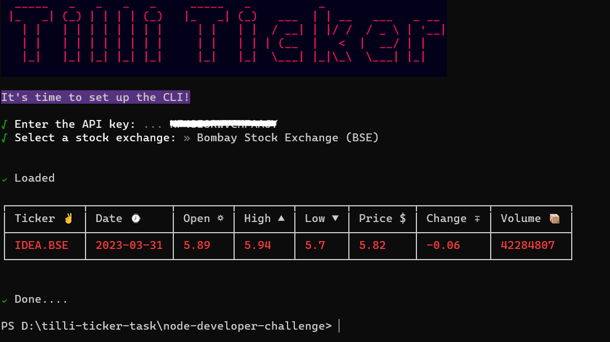

# Tilli Ticker

```tt``` is a CLI application that fetches stock details from the Alpha Vantage API. It allows you to track stocks and view summary statistics for any stock symbol and exchange supported by the API.

## Installation
Install the dependencies using ```cd node-developer-challenge && npm i```

```sh
npm run build
npm link
```

This command will link our package to the global npm directory on the local machine, allowing us to use the ```tt``` command directly.

## Usage
To use ```tt```, run the following command:

```
tt [options] exchange:ticker
```

The [options] argument is optional and specifies how you want to interact with tt CLI. The ```exchange:ticker``` specifies the exchange and stock symbol . If you do not specify an exchange, CLI will enter the interactive mode.

# Options
- -x, --exchange: Specifies the stock exchange to use when looking up the stock symbol. You can append the exchange directly to the ticker argument by preceding it with the exchange plus ":" (e.g. NASDAQ:AAPL). This option throws an error if the exchange does not exist or if the stock symbol is not found on the exchange.
- -a, --apiKey: Specifies the AlphaVantage API key to use. If there is no global config present or the global config has no API key, tt will launch interactive mode to query the user for an API key.
- -v, --view: Displays the stock summary statistics for the current day once found or chosen. This option is inferred to be true if the -s flag is not present.
- -s, --save: Saves the stock symbol and its summary statistics.
- -l, --list: Displays all saved stocks.
- -d, --delete: Deletes a saved stock symbol.
- -c, --configFile: Specifies the configuration file to use.
- -h, --help: Displays the help for the command.

# Config FILES
  `tt -c .ttrc`
  The global configuration file.

# Diagnostics
The following diagnostics may be issued on stderr:

- Rate limit exceeded.: The API key used in the configuration has gone past the rate limit set by the AlphaVantage API. Please wait for a new rate period or upgrade your API key.
- Invalid API key.: The provided API key is invalid or has been revoked. Please check your API key and try again.
- Stock symbol not found.: The specified stock symbol could not be found. Please verify the stock symbol and try again.
- Stock exchange not supported.: The specified stock exchange is not supported by the AlphaVantage API. Please check the exchange abbreviation and try again.
- Configuration file error.: An error occurred while reading or parsing the configuration file. Please verify the contents of the configuration file and try again.

# Examples

View Help

```sh
tt --help
```



Enter Interactive Mode
```
tt
```


View and save the ticker.
```
 tt -s -v IDEA
```



Following Exchange & Tickers can be used to test the application Quickly.

- exchange ``BSE``

- Tickers
``
RELIANCE
TATAPOWER
IRCTC
IDEA
ZEELEARN
``